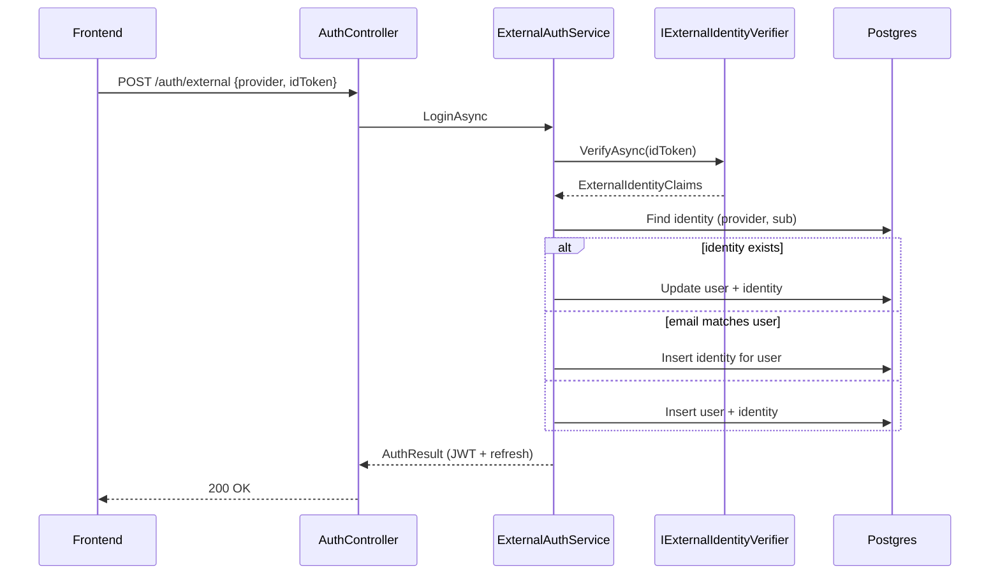

# Multi-Provider Auth Identities — Upgrade Plan

> **For agentic workers:** REQUIRED SUB-SKILL: Use superpowers:subagent-driven-development (recommended) or superpowers:executing-plans to implement this plan task-by-task. Steps use checkbox (`- [ ]`) syntax for tracking.

**Goal:** Refactor auth persistence and login flow so external providers (Google today, Microsoft/GitHub/etc. later) plug in via code + config only — **no further `users` table or migration changes** when adding a provider.

**Architecture:** `users` holds the internal profile (`Id`, `Email`, `Name`, `DisplayName`, `Bio`, `AvatarUrl`, `SecurityStamp`). `user_identities` holds one row per linked provider account (`provider` + `provider_sub`). Login verifies an ID token through a registered `IExternalIdentityVerifier`, upserts identity + user, then mints the same JWT/refresh tokens as today. New providers = new verifier class + options section + DI registration (+ frontend button); schema stays fixed.

**Prerequisite:** Auth MVP from `2026-06-02-auth-user-management.md` is implemented (or in progress with `GoogleSub` on `users`).

**Tech Stack:** .NET 8, EF Core + Npgsql — same as auth MVP. No frontend scope except a one-line note where API shape changes.

---

## Design rules (do not violate)

1. **Never add provider-specific columns to `users`** again (`GoogleSub`, `MicrosoftSub`, etc. are removed by this plan).
2. **Provider id is a short string constant** in code (e.g. `AuthProviders.Google = "google"`). Not a Postgres enum — new providers do not need migrations.
3. **Lookup key is always** `(provider, provider_sub)` on `user_identities`.
4. **Account linking:** If identity is missing but `users.email` matches (case-insensitive), attach a new identity to that user. If no user, create both. Keeps unique `Email` on `users`.
5. **`RefreshToken` unchanged** — still keyed by `UserId` only.
6. **JWT claims unchanged** — `sub` = `users.id`, `email`, `security_stamp`.

### Adding a future provider (checklist — no DB work)

| Step | Action |
|------|--------|
| 1 | Add `AuthProviders.{Name}` constant |
| 2 | Implement `IExternalIdentityVerifier` (validate token, return `ExternalIdentityClaims`) |
| 3 | Bind `{Provider}:ClientId` (and tenant/audience if needed) in `appsettings` |
| 4 | Register verifier in DI (`IEnumerable<IExternalIdentityVerifier>` or keyed registry) |
| 5 | Frontend: provider SDK → ID token → `POST /api/auth/external` with `{ provider, idToken }` |

Optional: thin `POST /api/auth/{provider}` route that delegates to the same service — convenience only, not required.

---

## Scope

**Included:**
- `UserIdentity` entity + EF config + migration with backfill from `GoogleSub` / `GoogleAvatarUrl`
- Remove `GoogleSub`, `GoogleAvatarUrl` from `User`
- `ExternalAuthService` (provider-agnostic login orchestration)
- Refactor `GoogleTokenVerifier` → `IExternalIdentityVerifier`
- `POST /api/auth/external` + keep `POST /api/auth/google` as backward-compatible wrapper
- Update `AuthService` / tests that reference `GoogleSub`

**Excluded (separate plans when needed):**
- Microsoft Entra / MSAL UI (only the hook is prepared here)
- Custom avatar override logic (keep current “sync `AvatarUrl` from login provider picture” behavior)
- Email/password, admin users, roles

---

## Target schema

### `users` (after upgrade)

| Column | Notes |
|--------|--------|
| `id` | PK, JWT `sub` |
| `email` | Unique, required |
| `name` | From provider on login |
| `display_name`, `bio` | User-editable via `PATCH /me` |
| `avatar_url` | Display URL; updated from active login provider when no custom override |
| `security_stamp` | Unchanged |
| `created_at_utc`, `updated_at_utc` | Unchanged |

### `user_identities` (new)

```csharp
namespace WorkflowHub.Data.Entities;

public sealed class UserIdentity
{
    public Guid Id { get; set; }
    public Guid UserId { get; set; }
    public string Provider { get; set; } = string.Empty;
    public string ProviderSub { get; set; } = string.Empty;
    public string? ProviderEmail { get; set; }
    public string? ProviderAvatarUrl { get; set; }
    public DateTime CreatedAtUtc { get; set; }
    public DateTime? LastLoginAtUtc { get; set; }
    public User User { get; set; } = default!;
}
```

**Indexes (EF configuration):**
- Unique `(provider, provider_sub)`
- Unique `(user_id, provider)` — at most one Google, one Microsoft, etc. per user
- Index `user_id` for joins

**Constants (Application layer):**

```csharp
public static class AuthProviders
{
    public const string Google = "google";
    // Future: Microsoft = "microsoft", GitHub = "github"
}
```

---

## File structure

**Create:**
- `backend/src/WorkflowHub.Data/Entities/UserIdentity.cs`
- `backend/src/WorkflowHub.Data/Persistence/Configurations/UserIdentityConfiguration.cs`
- `backend/src/WorkflowHub.Application/Auth/AuthProviders.cs`
- `backend/src/WorkflowHub.Application/Auth/Models/ExternalIdentityClaims.cs`
- `backend/src/WorkflowHub.Application/Auth/Services/IExternalIdentityVerifier.cs`
- `backend/src/WorkflowHub.Application/Auth/Services/ExternalAuthService.cs`

**Modify:**
- `backend/src/WorkflowHub.Data/Entities/User.cs` — remove `GoogleSub`, `GoogleAvatarUrl`
- `backend/src/WorkflowHub.Data/Persistence/Configurations/UserConfiguration.cs`
- `backend/src/WorkflowHub.Data/Persistence/AppDbContext.cs` — `DbSet<UserIdentity>`
- `backend/src/WorkflowHub.Application/Auth/Services/GoogleTokenVerifier.cs` — implement `IExternalIdentityVerifier`, `Provider => AuthProviders.Google`
- `backend/src/WorkflowHub.Application/Auth/Services/AuthService.cs` — delegate login to `ExternalAuthService` or replace with it
- `backend/src/WorkflowHub.Application/Auth/Models/AuthModels.cs` — add `ExternalLoginRequest`
- `backend/src/WorkflowHub.Api/Controllers/AuthController.cs` — add `POST external`, keep `google`
- `backend/src/WorkflowHub.Application/Bootstrap/BusinessBootstrapper.cs` — register verifiers + `ExternalAuthService`
- Auth unit/integration tests referencing `GoogleSub`

**Migration name:** `RefactorAuthToUserIdentities`

---

## Task 1: Persistence + migration

**Files:** entities/config/DbContext listed above.

- [ ] **Step 1: Add `UserIdentity` entity and configuration**  
  Max lengths: `provider` 32, `provider_sub` 128, `provider_email` 320, `provider_avatar_url` 2048. Cascade delete from `users` → `user_identities`.

- [ ] **Step 2: Add `DbSet<UserIdentity>` to `AppDbContext`**

- [ ] **Step 3: Generate migration** (includes new table; do not drop Google columns yet)

```bash
dotnet ef migrations add RefactorAuthToUserIdentities \
  --project backend/src/WorkflowHub.Data \
  --startup-project backend/src/WorkflowHub.Api
```

- [ ] **Step 4: Edit migration `Up()` — backfill then drop**

  1. Create `user_identities`.
  2. Insert from existing users:
     - `provider = 'google'`
     - `provider_sub = google_sub`
     - `provider_email = email`
     - `provider_avatar_url = google_avatar_url`
     - `user_id`, `created_at_utc` from user row
  3. Drop `users.google_sub` and `users.google_avatar_url` (and their indexes).

- [ ] **Step 5: Update `User` entity** — remove `GoogleSub`, `GoogleAvatarUrl`; update `UserConfiguration` (remove Google indexes/properties).

- [ ] **Step 6: Apply migration locally**

```bash
dotnet ef database update \
  --project backend/src/WorkflowHub.Data \
  --startup-project backend/src/WorkflowHub.Api
```

Expected: `users` has no Google columns; every existing user has one `google` identity row.

- [ ] **Step 7: Commit**

```bash
git add backend/src/WorkflowHub.Data
git commit -m "refactor: move provider ids to user_identities"
```

---

## Task 2: Provider-agnostic login service

**Files:** Application auth services listed above.

- [ ] **Step 1: Define contracts**

```csharp
public sealed record ExternalIdentityClaims(
    string Sub,
    string Email,
    string Name,
    string? Picture);

public interface IExternalIdentityVerifier
{
    string Provider { get; }
    Task<ExternalIdentityClaims> VerifyAsync(string idToken, CancellationToken cancellationToken = default);
}

public sealed record ExternalLoginRequest(string Provider, string IdToken);
```

- [ ] **Step 2: Implement `ExternalAuthService.LoginAsync(provider, idToken, deviceInfo)`**

  Flow:
  1. Resolve verifier by `provider` (case-insensitive); unknown provider → `400`.
  2. `VerifyAsync` → claims; map failures to `400` with provider-specific error code.
  3. Find `UserIdentity` by `(provider, claims.Sub)`.
  4. **If found:** load user; update `Name`, `Email` on user; update identity `ProviderEmail`, `ProviderAvatarUrl`, `LastLoginAtUtc`; apply avatar sync (same rule as today: set `user.AvatarUrl` from `Picture` when no custom override).
  5. **If not found:** `Users` by email (case-insensitive). If user exists → add identity. Else create `User` + identity.
  6. `SaveChanges`; issue access + refresh token; return `AuthResult`.

  Do **not** overwrite `DisplayName` or `Bio` on returning logins.

- [ ] **Step 3: Refactor `GoogleTokenVerifier`**

  - Implement `IExternalIdentityVerifier`.
  - `Provider` returns `AuthProviders.Google`.
  - Keep `GoogleJsonWebSignature.ValidateAsync` logic; return `ExternalIdentityClaims`.

- [ ] **Step 4: Register in DI**

  - Register all `IExternalIdentityVerifier` implementations.
  - Register `ExternalAuthService` as scoped.
  - `AuthService.LoginWithGoogleAsync` → calls `ExternalAuthService.LoginAsync(AuthProviders.Google, idToken, ...)`.

- [ ] **Step 5: Commit**

```bash
git add backend/src/WorkflowHub.Application
git commit -m "feat: provider-agnostic external auth login"
```

---

## Task 3: API surface + tests

**Files:** `AuthController.cs`, tests.

- [ ] **Step 1: Add `POST /api/auth/external`**

```json
{ "provider": "google", "idToken": "<jwt>" }
```

  Calls `ExternalAuthService.LoginAsync`. Error codes: `UNKNOWN_PROVIDER`, `EXTERNAL_AUTH_FAILED`, `VALIDATION_ERROR`.

- [ ] **Step 2: Keep `POST /api/auth/google`**

  Unchanged request body `{ "idToken" }`; internally calls same login with `AuthProviders.Google` (no breaking change for frontend).

- [ ] **Step 3: Update tests**

  - Replace assertions on `user.GoogleSub` with `user_identities` row `(google, sub)`.
  - Add test: second provider identity links to same user when email matches (mock second verifier or in-memory stub).
  - Add test: unknown `provider` returns 400.

- [ ] **Step 4: Build**

```bash
dotnet build backend/WorkflowHub.sln
dotnet test backend/WorkflowHub.sln
```

Expected: green.

- [ ] **Step 5: Commit**

```bash
git add backend/
git commit -m "feat: external auth endpoint and tests"
```

---

## Task 4: Verification

- [ ] **Step 1: Manual Google regression**

  - Existing Google login still works via `/api/auth/google` and via `/api/auth/external` with `provider: "google"`.
  - User row has no `google_sub` column; identity row exists.

- [ ] **Step 2: Document “add provider” in code**

  Add XML doc or short comment on `AuthProviders` pointing to the checklist in this plan’s **Design rules** section.

- [ ] **Step 3: Optional frontend follow-up** (not blocking)

  When wiring login UI, prefer `POST /api/auth/external` so new buttons only change the `provider` string. `loginWithGoogleIdToken` can call `external` with `google`.

---

## Self-review

| Check | Status |
|-------|--------|
| New provider needs migration? | No — only verifier + config + UI |
| `users` stays provider-agnostic? | Yes — Google columns removed |
| JWT / refresh / `/me` unchanged? | Yes |
| Account linking by email? | Yes — documented in flow |
| Scope small (4 tasks)? | Yes |
| Aligns with auth MVP avatar rules? | Yes — sync on login, no upload |

---

## Reference: login flow (after upgrade)


